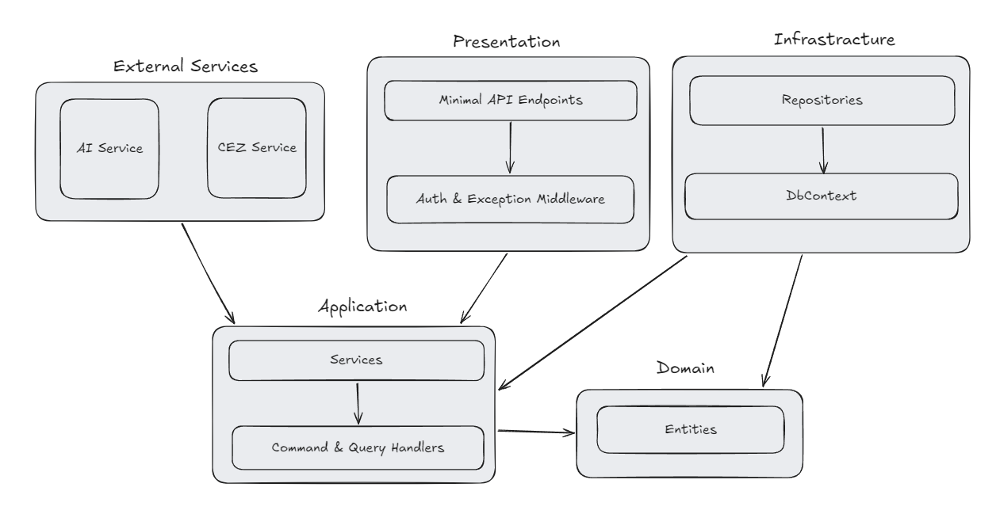
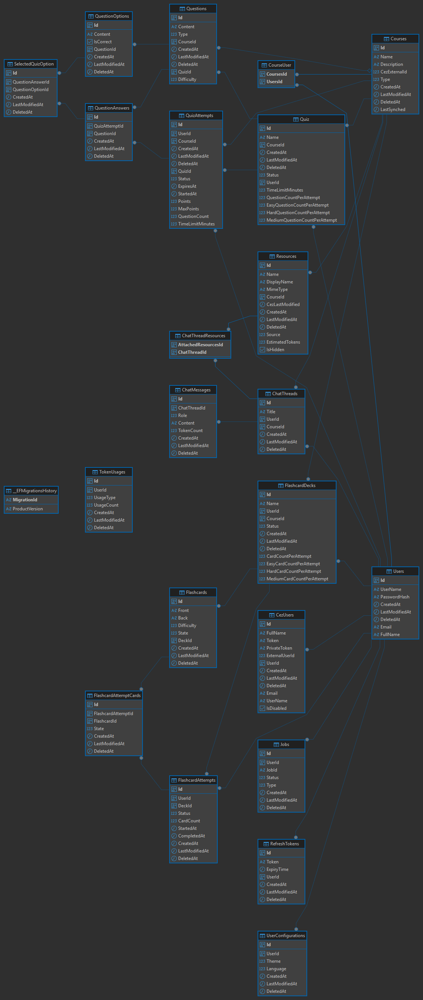

# CEZ Student Assistant

Full-stack student learning platform integrated with Moodle Services, featuring RAG-based document Q&A, automated flashcard and quizzes generation with progress tracking.

## Tech Stack

- **Backend**: C# / .NET 9 Web API, Clean Architecture, CQRS (MediatR), Entity Framework Core, PostgreSQL / SQL Server
- **Frontend**: React 18, TypeScript, Vite, Tailwind CSS
- **Integrations**: Moodle REST Web Services, LLM / RAG Engine
- **DevOps & Infrastructure**: Docker, Docker Compose, JWT (HttpOnly Cookies)

## Architecture

The solution follows Clean Architecture principles with strict layer boundaries:

- `CezStudentAssistant.Domain` - Pure domain entities, domain exceptions, enums, and repository interfaces (framework-decoupled).
- `CezStudentAssistant.Application` - CQRS Commands/Queries, MediatR handlers, and pipeline behaviors.
- `CezStudentAssistant.Infrastructure` - Persistence (`DbContext`, EF Core), repositories, security, and authentication.
- `CezStudentAssistant.API` - Minimal API endpoints, OpenAPI specification, and middleware pipeline.
- `ExternalServices/` - Deduplicated integration libraries (`CezStudentAssistant.Cez` for Moodle API and `CezStudentAssistant.AI` for RAG/GenAI).
- `src/cez-student-assistant-app/` - React 18 SPA with domain-driven custom hooks and typed API clients.

### Component Architecture



### Database Schema



## Key Features

- **Moodle Course Synchronization**: Automatic retrieval of enrolled courses, lecture materials, assignments, and grades via Moodle REST API.
- **RAG Document Chat**: Context-aware Q&A over lecture files (PDF/PPTX) using Retrieval-Augmented Generation.
- **AI Flashcard & Quiz Generation**: Automated creation of study decks and self-assessment quizzes directly from course lecture materials.
- **Progress Tracking**: Ability to see overall and material specific progress based on content difficulty

## Getting Started

### Prerequisites

- .NET 9.0 SDK
- Node.js 18+
- Docker & Docker Compose (Optional)

### Quick Start with Docker

```bash
docker-compose up --build
```

### Local Development Setup

1. **Backend**:
   ```bash
   cd src/CezStudentAssistant.API
   dotnet run
   ```

2. **Frontend**:
   ```bash
   cd src/cez-student-assistant-app
   npm install
   npm run dev
   ```

## Project Context

Developed as an Engineering Thesis Project at Bialystok University of Technology.
